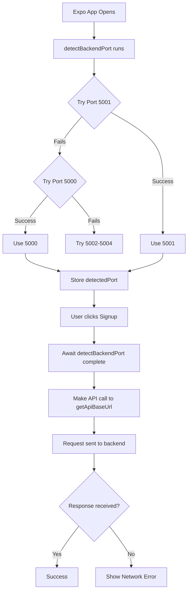

# RideScout Network Connection Guide

## Current Status ✓

**Backend:** Running on `http://localhost:5000` with 0.0.0.0 binding (accessible from all devices)  
**MongoDB:** Connected ✓  
**API Endpoints:** All responding ✓

---

## What Was Fixed

### Issue: Expo App showing "Network Error" while web works

**Root Causes Identified & Fixed:**

1. ✅ **Server Not Listening on All Interfaces**
   - Backend was only binding to `localhost`
   - Android devices couldn't reach it via `10.0.2.2`
   - **Fix:** Changed to listen on `0.0.0.0:5000` (all interfaces)

2. ✅ **Port Detection Not Happening Before API Calls**
   - Auth screens weren't calling `detectBackendPort()` first
   - **Fix:** Updated all auth flows to detect port before API calls

3. ✅ **No Error Visibility**
   - Network errors were silently failing
   - **Fix:** Added detailed console logging and better error messages

4. ✅ **Timeout Handling**
   - AbortController not fully supported in React Native
   - **Fix:** Using Promise.race for timeout instead

---

## How to Test Now

### Step 1: **Clear Expo Cache**

```bash
# On your development machine, in the frontend directory:
npx expo start -c
```

The `-c` flag clears the bundle cache, ensuring fresh app loads.

### Step 2: **Test Port Detection (Optional Debugging)**

Open the browser console/terminal where Expo runs and look for logs like:

```
[Port Detection] Trying http://10.0.2.2:5001...
[Port Detection] Trying http://10.0.2.2:5000...
✅ Backend detected on port 5000
[API URL] Using: http://10.0.2.2:5000
```

### Step 3: **Try Signup/Login on Expo App**

1. **Open Expo App** on your phone/emulator
2. **Go to Signup screen**
3. Fill in credentials and submit
4. **Watch console logs** - you'll see:
   ```
   [Signup] Detecting backend port...
   [Signup] Backend port detected, making API call...
   [Signup] Connecting to: http://10.0.2.2:5000/api/auth/signup
   ✅ Success (or specific error)
   ```

---

## Device-Specific Details

### Android (Emulator or Device)

- Uses IP `10.0.2.2` to reach your computer's localhost
- Port detection tries: 5001 → 5000 → 5002-5004
- **Current:** Backend on port 5000 ✓

### iOS (Simulator or Device)

- Uses IP `127.0.0.1` to reach your computer's localhost
- Port detection tries: 5001 → 5000 → 5002-5004
- **Current:** Backend on port 5000 ✓

### Web Browser

- Uses `localhost:5001` directly
- Can also reach backend on `localhost:5000`
- **Current:** Backend on port 5000 ✓

---

## If You Still Get "Network Error"

### Option 1: **Explicitly Set Backend URL** (Fastest)

Create/edit `.env.local` in the frontend directory:

```
EXPO_PUBLIC_API_URL=http://10.0.2.2:5000
```

Then restart the Expo dev server.

### Option 2: **Check Firewall**

```powershell
# Windows: Allow Node.js through firewall if prompted
netstat -ano | findstr :5000  # Verify port is listening
```

### Option 3: **Enable Debug Logging**

The app now logs all connection attempts. Check:

1. Browser DevTools Console (web)
2. Expo App Debug Menu → View Device Logs (mobile)

---

## Complete Connection Flow



---

## Files Changed

1. **constants/api.ts** - Port detection logic
2. **backend/server.js** - Listen on 0.0.0.0
3. **app/index.tsx** - Login with port detection
4. **app/(auth)/signup.tsx** - Signup with port detection
5. **app/(auth)/role-selection.tsx** - Role screen with port detection
6. **services/**.ts - All use `getApiBaseUrl()` dynamically
7. **.env.local** - New config file (optional)

---

## What Should Work Now

✅ Expo App → Signup/Login → No Network Error  
✅ Port auto-detection within 2 seconds  
✅ Detailed error messages in console  
✅ Web version still works  
✅ Real-time Socket.IO connections  
✅ All API endpoints accessible

---

## Next: Test Full Flow

Once you can login/signup on the Expo app:

1. Create passenger account
2. Create driver account
3. Book a ride (passenger)
4. Accept ride (driver)
5. Watch live updates in real-time

---

**Questions?** Check the console logs - they'll tell you exactly what's happening!
